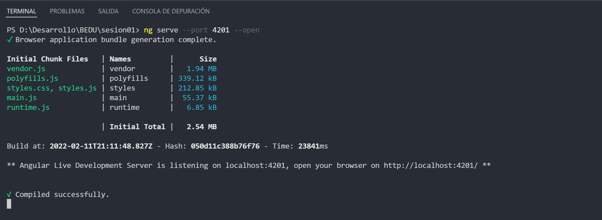
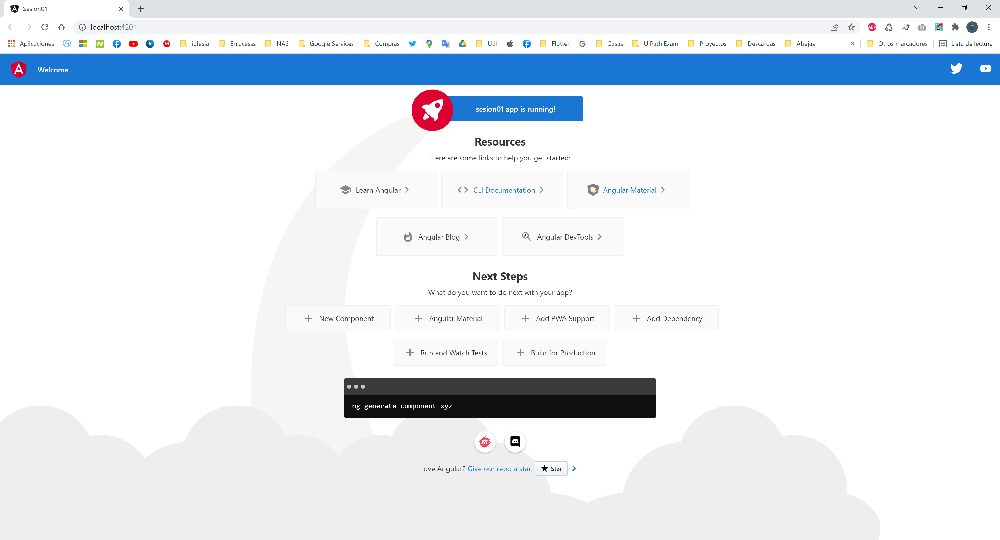

# Ejemplo 01: Iniciar un Proyecto

## Objetivo

- Iniciar el proyecto creado con angular con el nombre de sesion01.

## Desarrollo

Ya conoces la forma de instalar angular, es hora de poner en marcha tu proyecto

Notas: 
- puedes usar la terminal que se encuentra en VSCode para mayor comodidad.
    Para abrir la terminal en VSCode:
    
   
- Sigue algun patron de carpetas como este: C:/Develop/Curso/Sesion01

     
 

  
Una vez abierto tu proyecto tendras algo similar a esto:
  
    
  
    
      
    
      
    
      
    

Cuando tu proyecto este terminado, abrelo con VSCode para comenzar a utilizarlo.

Desde la terminal situado en la raiz del proyecto ejecuta:

 `ng serve --port 4201 --open` 
 
 
 Este comando pondra en marchar el proyecto en el puerto  `4201` y se abrira automaticamente tu navegador predeterminado, esto puede tomar un poco de tiempo mientras se compila. La terminal mostrara un resultado como este:

  
    

Al finalizar la terminal, tu navegador mostrara algo similar a esto:

  
    

:partying_face: Felicidades, tu proyecto angular esta listo. :partying_face: