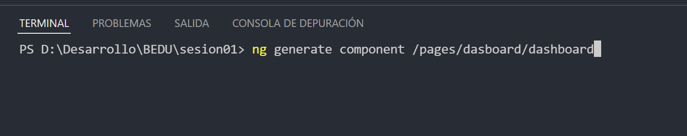
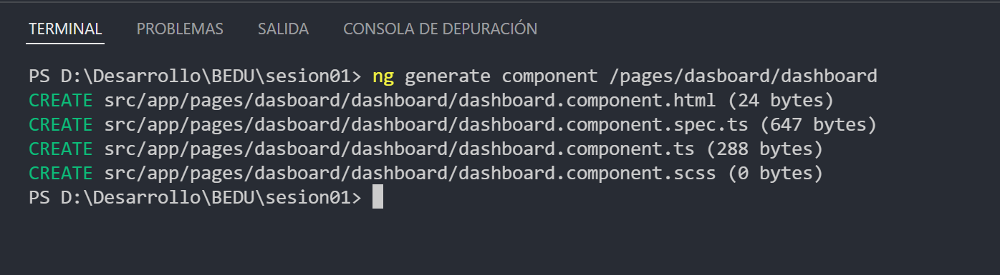
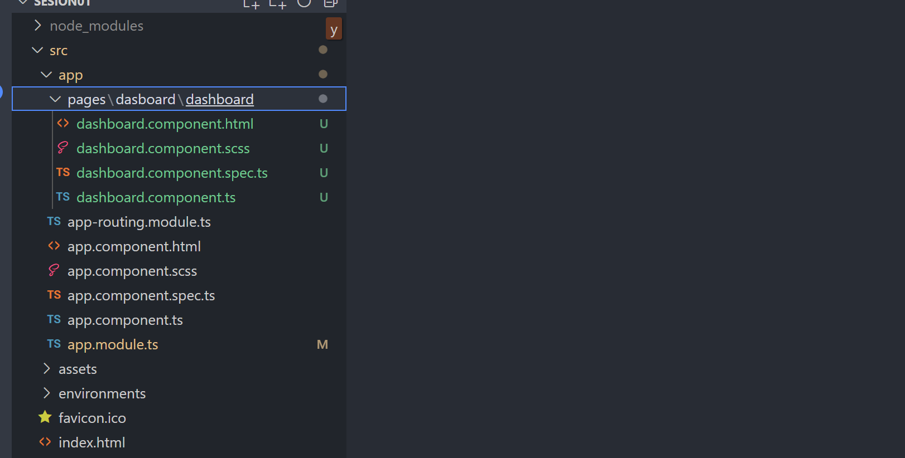
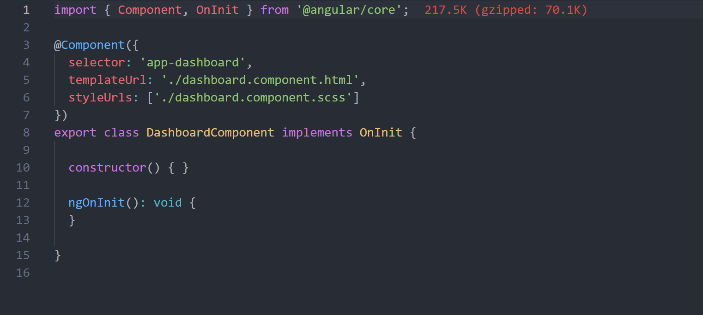

# Ejemplo 02: Crear un Componente

## Objetivo

- Crear un componente desde el cli.

## Desarrollo

Ya conoces la forma de iniciar un proyecto angular, es hora de crear nuestro primer componente que usaremos mas adelante.

Notas: 
- puedes usar la terminal que se encuentra en VSCode para mayor comodidad.
    Para abrir la terminal en VSCode:
    
- Sigue algun patron de carpetas como este: C:/Develop/Curso/Sesion01

Cuando tu proyecto este terminado, abrelo con VSCode para comenzar a utilizarlo.

Con el proyecto abierto en VSCode abre una nueva terminal y escribe:

`ng generate component /pages/dasboard/dashboard`
 

 

Al terminar la terminal mostrara un resultado como este:

 

 

 Ahora podras notar que el arbol de archivos se ha generado una carpeta pages y una carpeta dashboard.

  

 

Notas: 
- Es importante siempre crear una carpeta con el mismo nombre que contendra nuestro componente, directiva, pipe o servicio
 
 Si abres el archivo dashboard.component.ts notaras que se ha creado el nombre de la clase con el mismo nombre con el que declaramos en la terminal.

 

 

