# Sesión #: PostWork

## :dart: Objetivos

- Generar un Proyecto Angular listo para usar en el proyecto final.
- Crear componentes, pipes, directivas, etc. necesarias para el proyecto
- Identificar las mejores prácticas para la creación de un proyecto escalable y mantenible

- Usar el angular cli para generar los elementos necesarios.

## Antes de empezar

Al crear el proyecto te recomendamos usar una estructura de carpetas legible para esta y las demás sesiones.

Ejem:

develop/
├─ angular2022/
│ ├─ sesion01/
│ ├─ sesion02/
│ ├─ sesion…/
├─ Work
│ ├─ dashboardApp/

## ⚙ Requisitos

- VSCode
- Computadora personal con Mac/Windows/Linux
- NodeJS
- TypeScrip

## Desarrollo

- Crea una estructura de carpetas ordenadas
- Usa PascalCase para los nombres de las clases en los componentes.
- Los nombres de los archivos de componentes y carpetas deben usar kebab-case
- Crea las mismas directivas, pipes, páginas etc. que usamos en el work.

    
Solución 

    
 Primero abriremos VSCode y abriremos una nueva terminal, y nos posicionamos en la carpeta raiz del curso

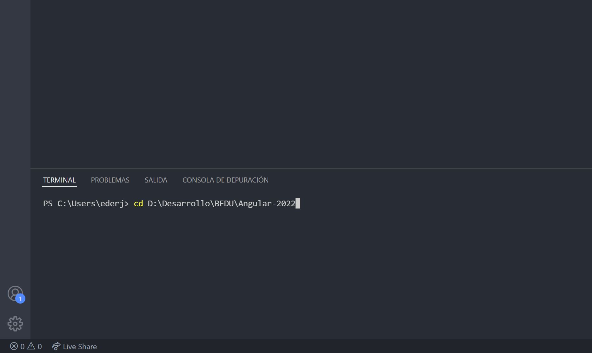
  
 Seguidamente creamos una carpeta llamada proyectoFinal que contendra nuestro proyecto.
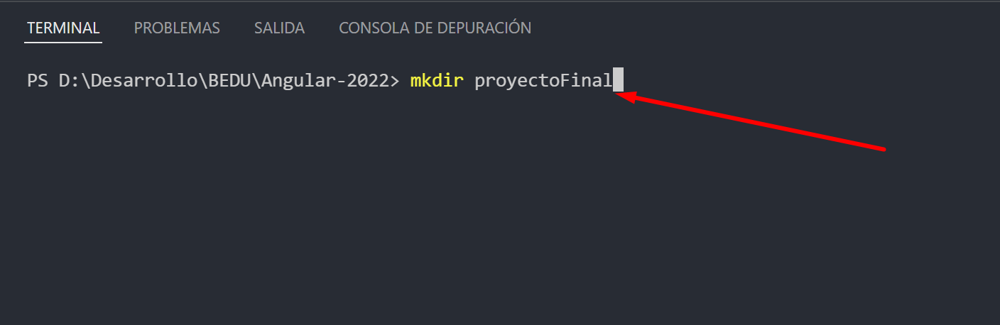
      
 Una vez creada la carpeta entramos en ella para ejecutar los comando necesarios.
    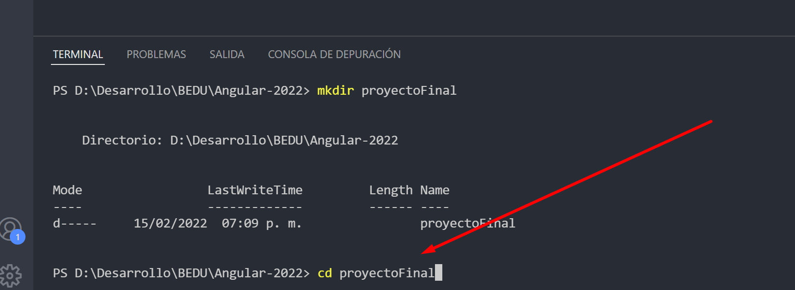

  
 Ya dentro de la carpeta ejecutamos el comando `ng new dashboardApp` y presionamos `ENTER`
    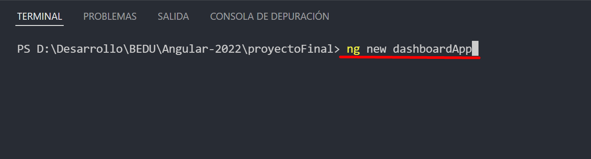

  
 Al presionar `ENTER` la terminal nos preguntara si queremos agregar el routing; solo escribimos la tecla `y` y presionamos `ENTER`
    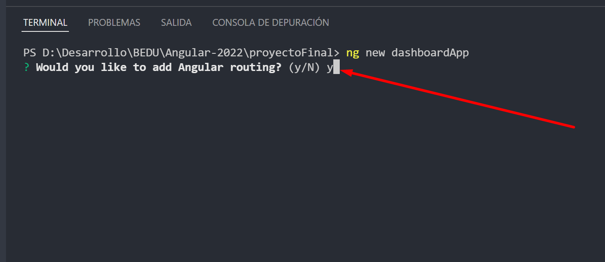

  
 Despues nos preguntara que formato de estilos queremos usar, con las teclas de navegacion bajamos hasta la opcion SCSS y presionamos `ENTER`
    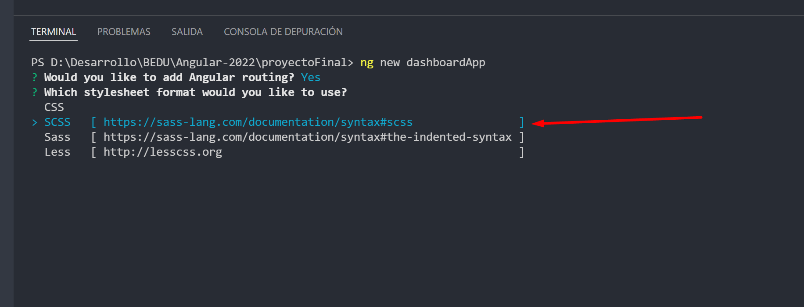

  
 En este punto el cli comenzara a crear y descargar los archivos necesarion para el proyecto.
    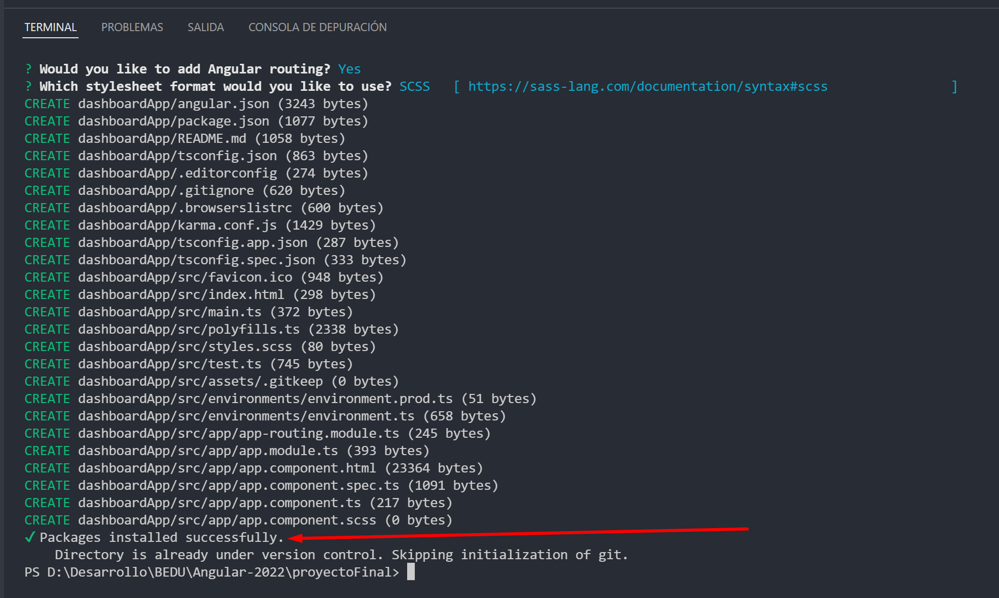
  

  
 Ya terminado el proceso abriremos el proyecto.
    

  
Seleccionamos la carpeta correspondiente
    

  
Abrimos nuevamente la terminal.
    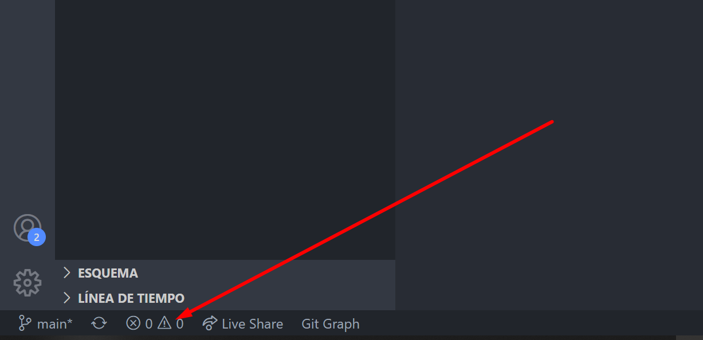

 
    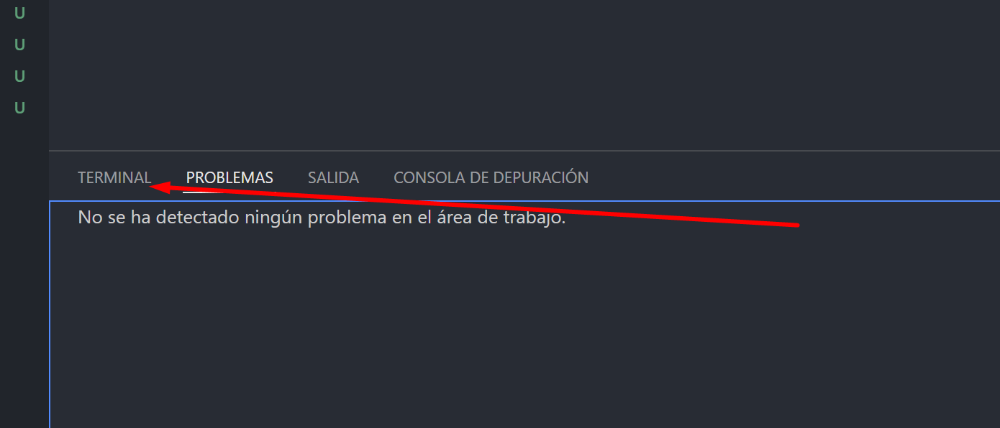
  
Una vez en la terminal escribimos el comando `ng serve --open`
    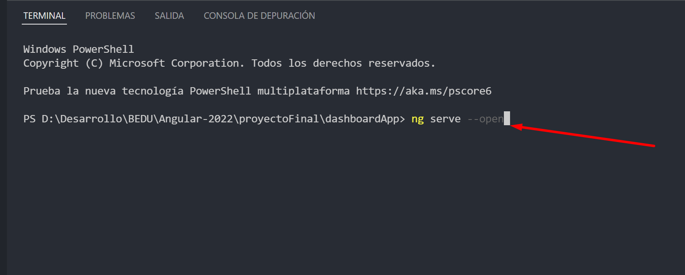

  
Este comando comenzara a compilar el proyecto.
    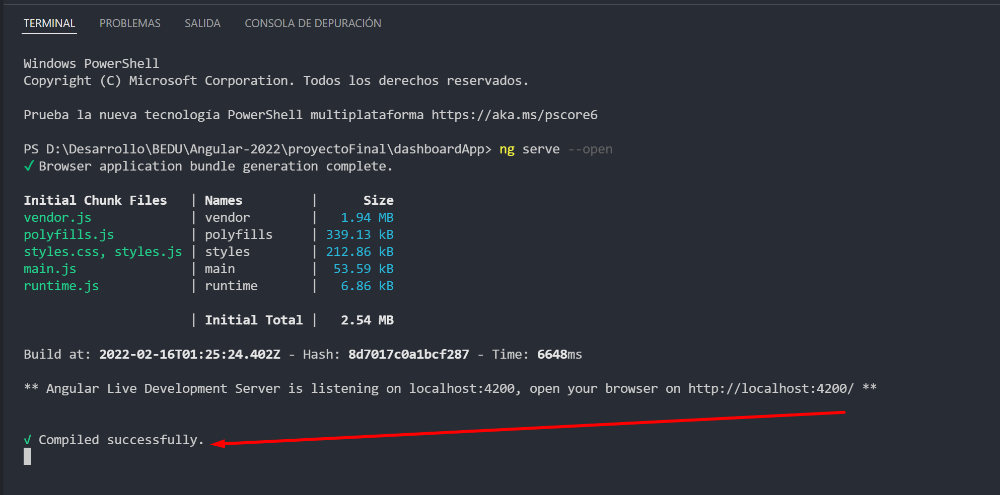
    
Se nos abrira una ventana del navegador automaticamente con nuestro proyecto funcionando.
    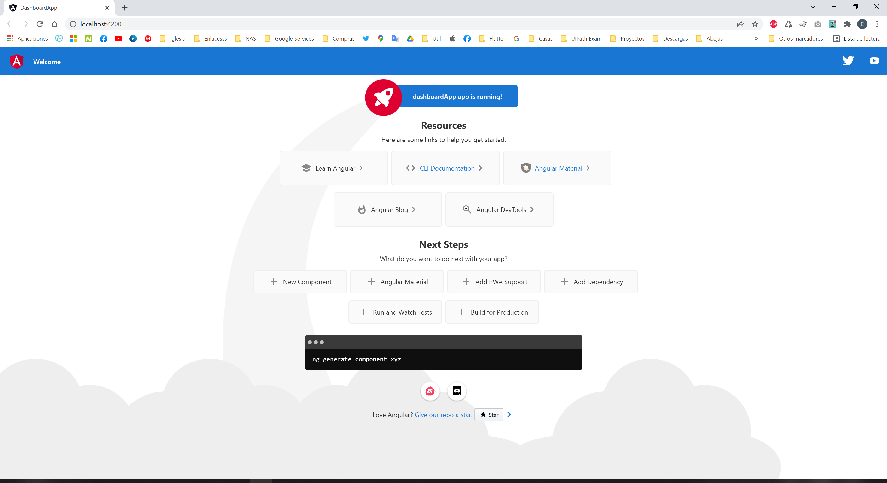

  
Ahora abriremos una nueva ventana de la terminal.
    

  
Ahora crearemos nuestra pagina que usaremos mas adelante como login de nuestra aplicacion, para ello ejecutamos el comando:
 `ng generate component /pages/login/login-page`
  
    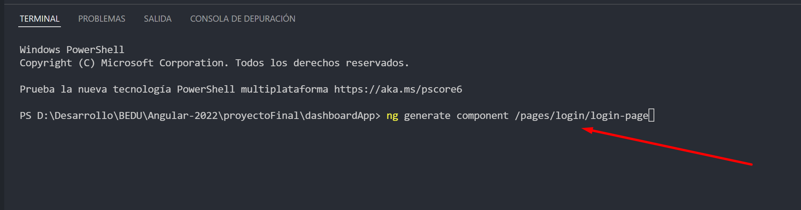
  
Este comando creara las carpetas y componentes automaticamente.
  
    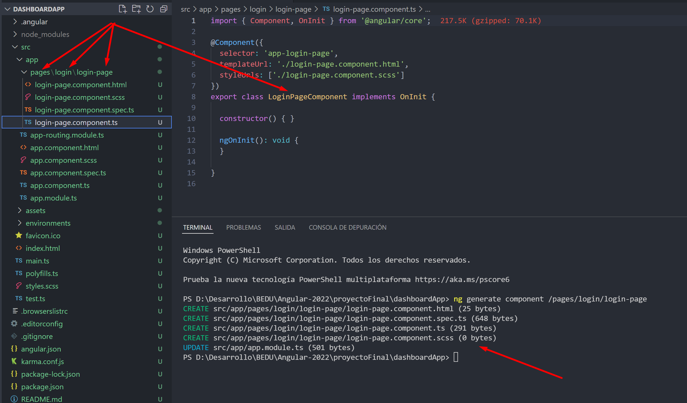

  
Ahora crearemos una directiva para convertir texto a minusculas, esta directiva la usaremos mas adelante. Ejecutamos el comando:
`ng generate directive /core/directives/to-lower-case/to-lower-case`
  
    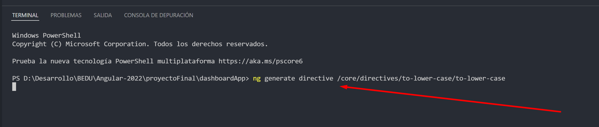

  
Este comando creara las carpetas y componentes automaticamente.
  
    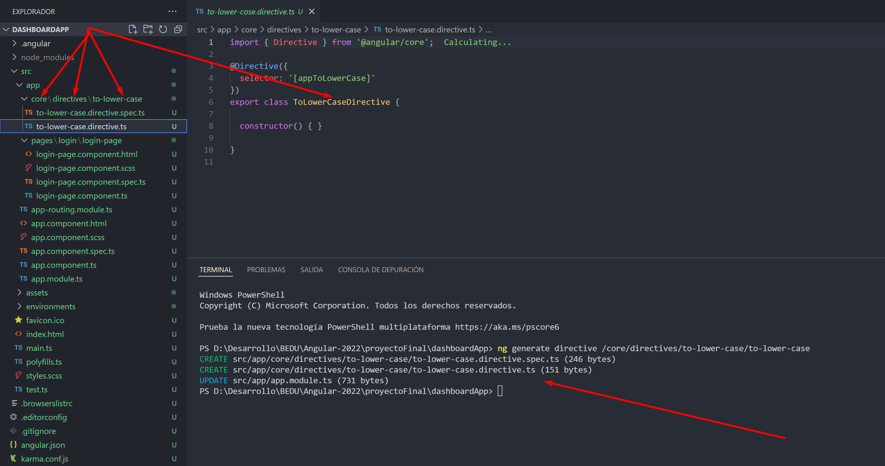

  
Tabien crearemos un pipe para tranformar fechas de manera customizada, este pipe lo usaremos mas adelante. Ejecutamos el comando:
`ng generate pipe /core/pipes/date-custom/date-custom`
  
    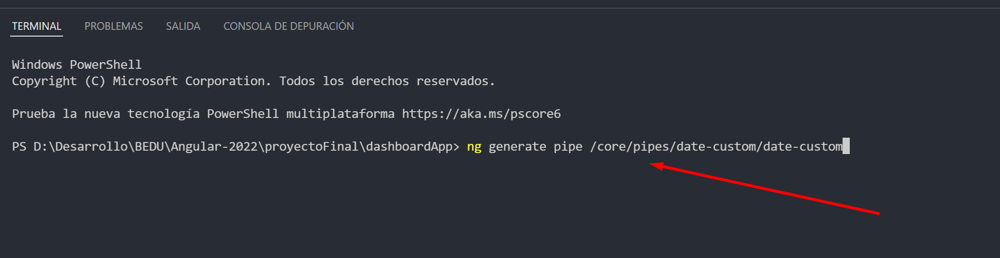

  
Este comando creara las carpetas y componentes automaticamente.
  
    

  
Con todo esto aplicado ahora inspeccionaremos el archivo app.module.ts
  
    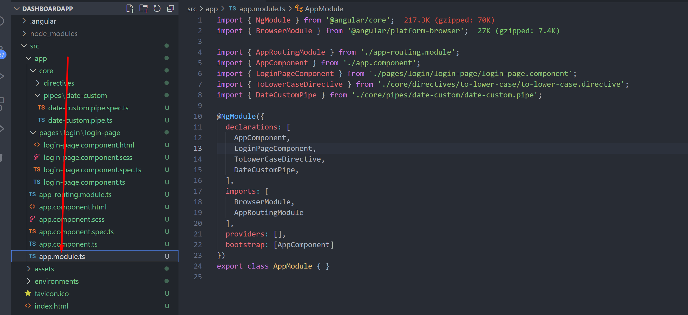

  
Ahora podemos comprobar que el cli ha echo todas las declaracion automaticamente.
  
    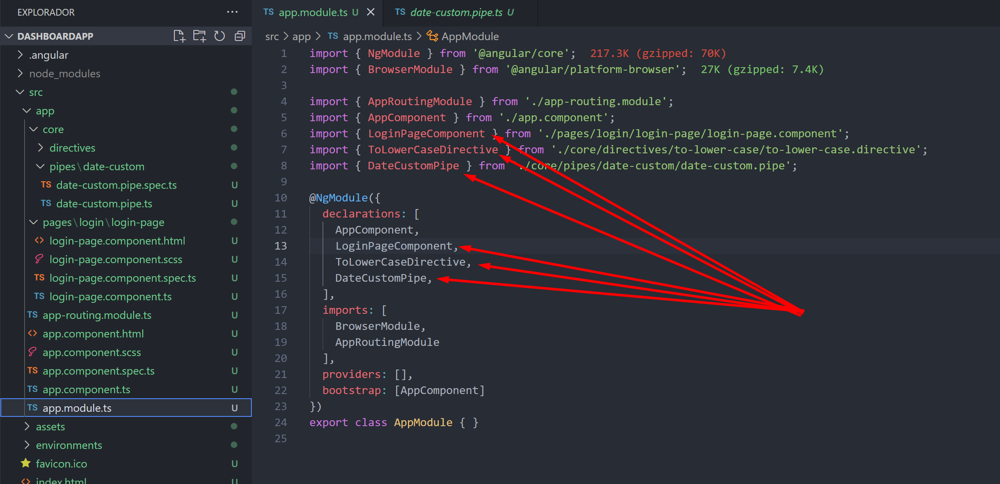

   

En este punto la inicializacion del proyecto esta terminada.

