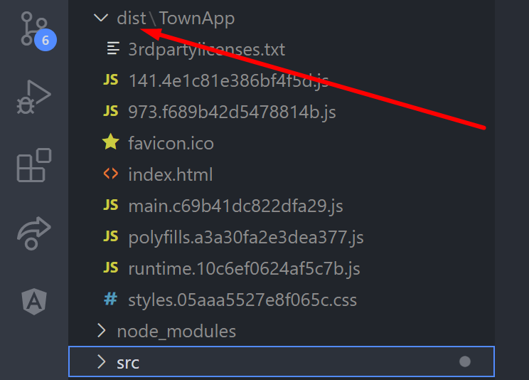

## Sesión 1: Angular CLI 🤖

### 1. Objetivos :dart: 

- Reconocer los comandos angular.
- Generar un proyecto desde angular cli
- Generar componentes, directivas, pipes,modulos a través del cli

### 2. Contenido :blue_book:

El CLI de Angular es una herramienta de línea de comandos que se utiliza para inicializar, desarrollar, estructurar y mantener aplicaciones de Angular directamente desde la terminal.

#### <ins>Definición</ins>

Angular CLI es un Command Line Interface (interfaz en línea de comandos, en español), desarrollada por los equipos de Angular. Este CLI permite crear proyectos en los que el CLI podrá añadir archivos y más exactamente, entidades Angular. Será posible añadir módulos, componentes, servicios o directivas en una línea de comandos.

**Nota al Experto:**
  
 + Históricamente, Angular CLI ha migrado desde SystemJS a Webpack para la parte módulo loader, beneficiándose de todo lo que permite hacer Webpack como Task Runner, lo que quiere decir que tareas como el bundling, se hacen con Webpack.

---

 

Obtener la versión de Angular
---

`ng v`

Este comando sirve para consultar la version de ANGULAR que tienes instalada

Obtener ayuda en la terminal
---

`ng help`

Este comando sirve para obtener ayuda sobre el cli de angular.

Crear un nuevo proyecto en Angular
---

`ng new nombre-del-proyecto`

- [**`RETO 1`**](./Reto-01)

Ejecutar el proyecto Angular
---

El comando ”ng serve” nos despliega un servidor sobre el puerto 4200(puedes usar el puerto de tu preferencia si el 4200 no esta disponible), por defecto, y el parametro ”--open” nos abrira una ventana del navegador en la que podremos ver por primera vez la aplicación en marcha.

 

`ng serve`

 

`ng s`

 

`ng serve --open`

 

`ng serve --port 4201`

- [**`Ejemplo 1`**](./Ejemplo-01)

Crear una compilacion
---

Una aplicación no es muy útil si no la podemos desplegar a los usuarios, así que ng build nos ayuda en eso.Para ello escribimos:

`ng build`

Se nos crea una carpeta dist con lo compilado de nuestra aplicación.
Es decir nos muestra los archivos bundle:

  
    

 

Ejecutar casos de prueba
---

 - Tests unitarios:
Los tests unitarios normalmente nos van a permitir testear elementos individuales. Podemos usarlos, y normalmente lo haremos, para testear modelos y, en multitud de ocasiones, para comprobar que los objetos se forman de forma correcta.

 - Tests de integración:
Los tests de integración nos van a permitir testear funcionalidades complejas dentro de una aplicación, como por ejemplo el login. Podremos crear los tests necesarios para evaluar si nuestra app está realizando la función de login correctamente, así como si rechaza también de forma correcta usuarios no autorizados. Este es un buen ejemplo de un test de integración en el que intervienen varios elementos de nuestra app.

Cabe destacar que con Angular, desde hace unas cuantas versiones, no necesitamos configurar nada adicional para que funcione la suite de testing. Una vez creado el proyecto, tan solo será necesario ejecutar:

`ng test`

y se ejecutarán los primeros tests, mostrándonos algo así:

Crear un nuevo componente
---

Un componente en Angular es un elemento que está compuesto por:

 - Un archivo que será nuestro Template (app.component.html), el cual es nuestro HTML, que es el que se va a visualizar en la interfaz de usuario, la vista o en términos más simples lo que vas a ver en la página. 

 - Un archivo de lógica, la cual es la que pondremos en un archivo .ts (como por ejemplo app.component.ts), ese archivo debe incluir una clase y esta es la que va a contener las propiedades que se van a usar en la vista (HTML) y los métodos que será las acciones que se ejecutarán en la vista. En este archivo de lógica también se incluye una metadata, que es definida con un decorador,  que identifica a Angular como un componente.
 - Un archivo para el CSS (podemos usar un preprocesador como SASS o LESS), donde incluiremos los estilos, lo que nos ayuda a hacer bonita nuestra aplicación.

`ng generate component nombrecomponente`

pero es recomendable usar - entre palabras y angular generara automaticamente el nombre de la clase usando PascalCase.

`ng generate component nombre-componente`

Lo anterior generaria un componente con el nombre NombreComponenteComponent

Ademas podemos colocar la ruta en donde se generara el componente:

`ng generate component /ruta/hacia/elcomponente/nombre-componente`

- [**`Ejemplo 2`**](./Ejemplo-02)

- [**`RETO 2`**](./Reto-02)

Crear una directiva en Angular
---

Las Directivas extienden el HTML usando para ello una nueva sintaxis. Con ella podemos usar lógica que será ejecutada en el DOM (Document Object Model).

Cada Directiva que usamos tiene un nombre, y determina donde puede ser usada, sea en un elemento, atributo, componente o clase.
Se dividen en tres tipos diferentes:

- Directivas de Atributo
- Directivas de estructurales
- Componentes

Podemos generar una directiva usando el siguiente comando:

`ng generate directive mi-directiva`

Ademas podemos colocar la ruta en donde se generara la directiva:

`ng generate directive /ruta/hacia/directives/mi-directiva`

- [**`RETO 3`**](./Reto-03)

**Nota al Experto:**
  
 + Recuerda usar buenas practicas para almacenar cada elemento que crees.

Crear un servicio en Angular
---

Un servicio es la capa encargada de traer/proporcionarnos los datos a nuestra aplicación de Angular.

Normalmente, nuestro servicio para acceder a estos datos suelen conectarse al servidor donde están almacenada dicha información, por ejemplo una BBDD, una API Rest, etc., Para poder crear nuestro servicio usamos el comando:

`ng generate service mi-servicio`

Ademas podemos colocar la ruta en donde se generara el servicio:

`ng generate directive /ruta/hacia/services/mi-servicio`

- [**`RETO 4`**](./Reto-04)

**Nota al Experto:**
  
 + Recuerda usar buenas practicas para almacenar cada elemento que crees.

Crear una Pipe
---

Los pipes son una herramienta de Angular que nos permite transformar visualmente la información, por ejemplo, cambiar un texto a mayúsculas o minúsculas, o darle formato de fecha y hora.

El valor de la información formateada no cambia, sólo lo hace su aspecto. 🐴 --> 🦄

Para generar un pipe usamos el siguiente comando:

`ng generate pipe mi-pipe`

Ademas Angular trae una serie de pipes por defecto - [**`(documentación oficial aquí)`**](https://angular.io/api?type=pipe)  pero también nos permite construir nuestros propios pipes. 

- [**`RETO 5`**](./Reto-05)

**Nota al Experto:**
  
 + Recuerda usar buenas practicas para almacenar cada elemento que crees.

Crear un módulo
---

NgModule es el componente básico crear una aplicación con Angular, ademas de ser la más compleja, ya que existen diferentes ámbitos. Puedes visitar la seccion de FAQ oficial de angular para mas detalles [**`(FAQ oficial aquí)`**](https://angular.io/guide/ngmodule-faq).

El propósito de NgModule es declarar cada elemento que creas en Angular. Existen dos tipos de estructuras principales:

- declarations: se utiliza para las cosas que usas en tus plantillas, principalmente componentes (~ vistas: las clases para mostrar datos), pero también directivas y pipes
- providers: se utiliza para los servicios (~ modelos: las clases para obtener y manejar datos).

Para generar un modulo usamos el comando

`ng generate module mi-modulo`

Ademas podemos colocar la ruta en donde se generara el modulo:

`ng generate module /ruta/hacia/elmodulo/mi-modulo`

- [**`RETO 6`**](./Reto-06)

**Nota al Experto:**
  
 + Recuerda usar buenas practicas para almacenar cada elemento que crees.

Crear un Guard en la ruta
---

Los Guards en Angular, podriamos llamarlos: middlewares que se ejecutan antes de cargar una ruta y determinan si se puede cargar dicha ruta o no. Existen 4 tipos diferentes de Guards (o combinaciones de estos) que son los siguientes:

- (CanActivate) Antes de cargar los componentes de la ruta.
- (CanLoad) Antes de cargar los recursos (assets) de la ruta.
- (CanDeactivate) Antes de intentar salir de la ruta actual (usualmente utilizado para evitar salir de una ruta, si no se han guardado los datos).
- (CanActivateChild) Antes de cargar las rutas hijas de la ruta actual.

Como middleware, estos componentes se ejecutan de manera intermedia antes de determinadas acciones y si retorna `true` la ruta seguiría su carga normal, en caso negativo, el Guard retornaría `false` y la ruta no se cargaría. Generalmente en caso de que no se cumpla la condición del Guard, se suele hacer una redirección a la ruta anterior o a una ruta definida como la interfaz de autenticación.

para crear nuestro guard usamos el comando:

`ng generate guard mi-guard`

- [**`RETO 7`**](./Reto-07)

3. Postwork :memo:
---

Encuentra las indicaciones y consejos para reflejar los avances de tu proyecto de este módulo.

- [**`POSTWORK SESIÓN 1`**](./Postwork/)

 

 

