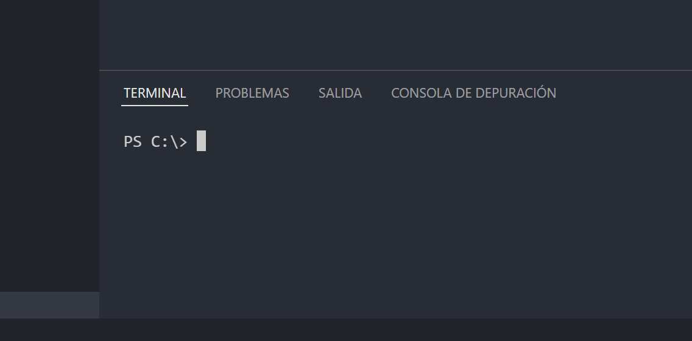

# Reto #: Crear un nuevo Proyecto

## Objetivo

- Generar un nuevo proyecto con angular con el nombre de sesion01.

## Desarrollo

Ya conoces la forma de instalar angular, es hora de crear tu primer proyecto siguiendo buenas practicas para organizar este y futuras apps creadas con angular.

Notas: 
- puedes usar la terminal que se encuentra en VSCode para mayor comodidad.
    Para abrir la terminal en VSCode:
    
    
     
    
     
    

- Sigue algun patron de carpetas como este: C:/Develop/Curso/Sesion01

Cuando tu proyecto este terminado, abrelo con VSCode para comenzar a utilizarlo y desde la terminal situado en la raiz del proyecto ejecuta `ng serve` para poner en marcha la app, esto puede tomar un poco de tiempo mientras se compila.

