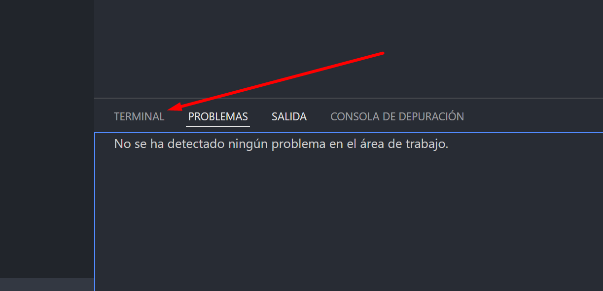
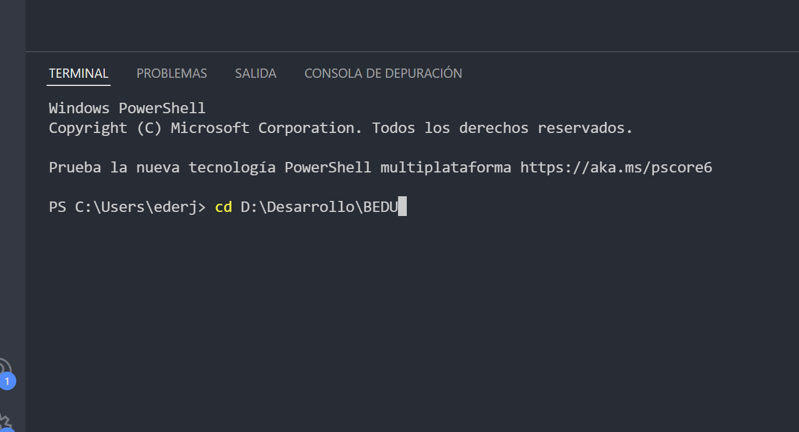
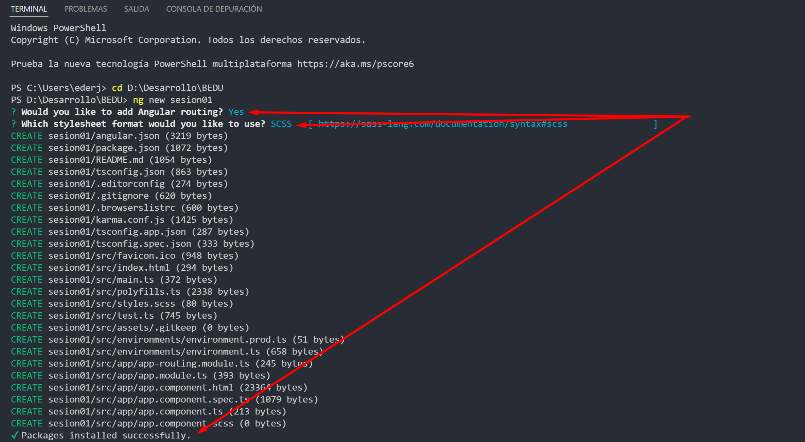

# Reto 01#: Crear un nuevo Proyecto

## Objetivo

- Generar un nuevo proyecto con angular con el nombre de sesion01.

## Desarrollo

Ya conoces la forma de instalar angular, es hora de crear tu primer proyecto siguiendo buenas practicas para organizar este y futuras apps creadas con angular.

Notas: 
- puedes usar la terminal que se encuentra en VSCode para mayor comodidad.
    Para abrir la terminal en VSCode:
    
    
     
    
     
    y puedes cambiar la ruta inicial a alguna ruta para gestionar el curso
      
    
  

- Sigue algun patron de carpetas como este: C:/Develop/Curso/Sesion01

    
Solución 

    
  `ng new sesion01`
  
    
  

