# Sesión 2: PostWork

## :dart: Objetivos

- Utilizar proyecto angular para generar nuevos modulos.
- CRear Componente compartido entre Funcionalidades
- Usar el angular cli para generar los elementos necesarios.

## Antes de empezar

Debes usar el proyecto creado en el postwork de la sesion 01 llamado `dashboardApp`.

## ⚙ Requisitos

- VSCode
- Computadora personal con Mac/Windows/Linux
- NodeJS
- TypeScrip

## Desarrollo

- Crea Modulo Llamado SharedModulo
- Crear unComponente llamado LayoutComponent.
- Importar el componentente LayoutComponent.

    
Solución 

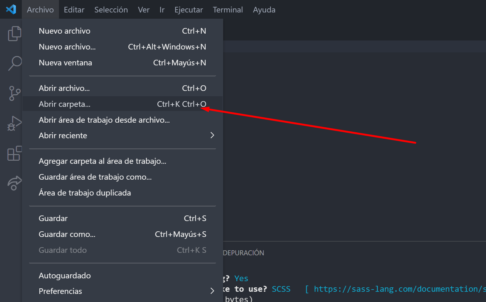

  
Seleccionamos la carpeta correspondiente

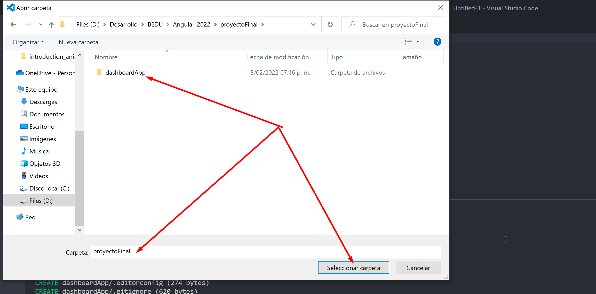

Primero abriremos VSCode, abriremos nuestro proyecto y lo correremos con el comando `ng serve --open` y esperamos a que el proceso termine.
  

 
Se nos abrira una ventana del navegador automaticamente con nuestro proyecto funcionando.

 
Ahora abriremos una nueva ventana de la terminal.
 

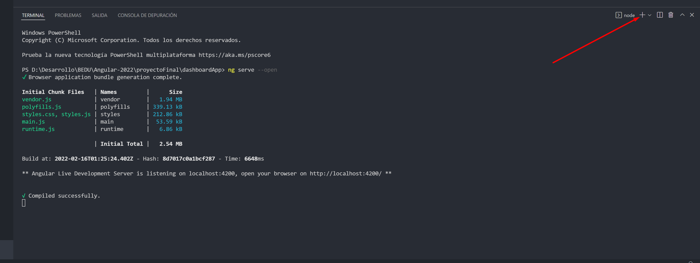

  
Ahora en la nueva terminal escribiremos el siguiente comando:

`ng generate module /core/modules/shared`

  

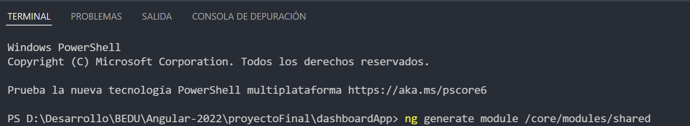

  
Al finalizar tendremos como resultado algo como esto:
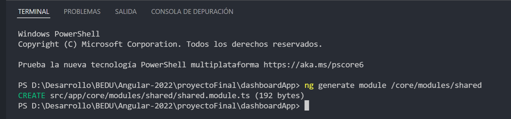
 
 
Y veremos en el arbol de archivos que se ha generado el modulo correspondiente
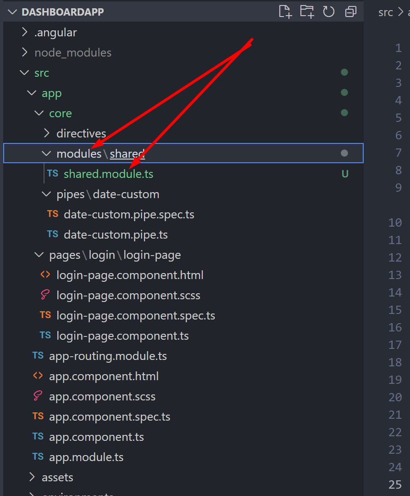
 
 

Si  inspeccionamos el archivo `SharedModule` veremos en su contenido lo basico que necesita para funcionar.
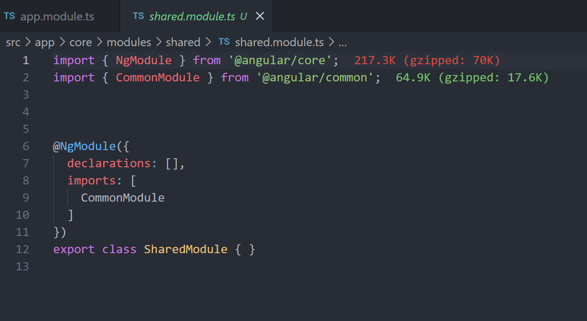
 
 

Ahora en la terminal escribiremos el siguiente comando:

`ng generate component /core/shared/layout/layout-component --skip-import`

Usamos el flag --skip-import para evitar la importacion automatica del componente a un modulo para poder importarlo manualmente.

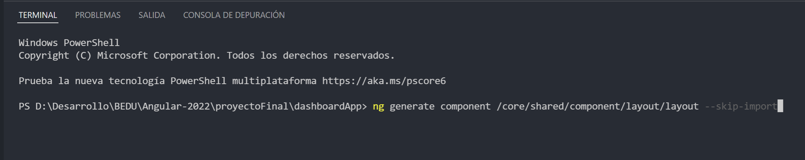
 
 
Al finalizar tendremos como resultado algo como esto:
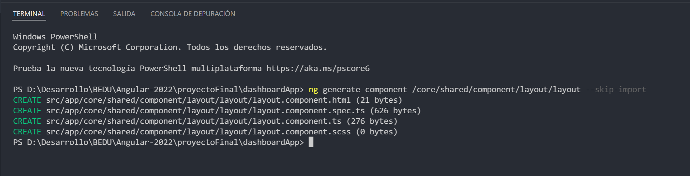
 
 

Si inspeccionamos el archivo `layout-component` veremos en su contenido lo basico que necesita para funcionar.

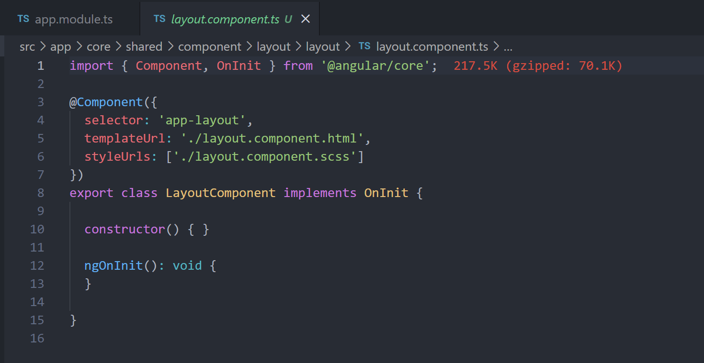
 
 

Ahora importaremos el `LayoutComponent` a nuestro `SharedModule` para poderlo reutilizarlo.Para ello abrimos el `SharedModule` y escribimos lo siguiente despues de la ultima importacion.

`import { LayoutComponent } from './../../shared/component/layout/layout/layout.component';`

Utilizamos la clase LayoutComponent y la colocamos dentro de las declaraciones del SharedModule quedando de la siguiente manera

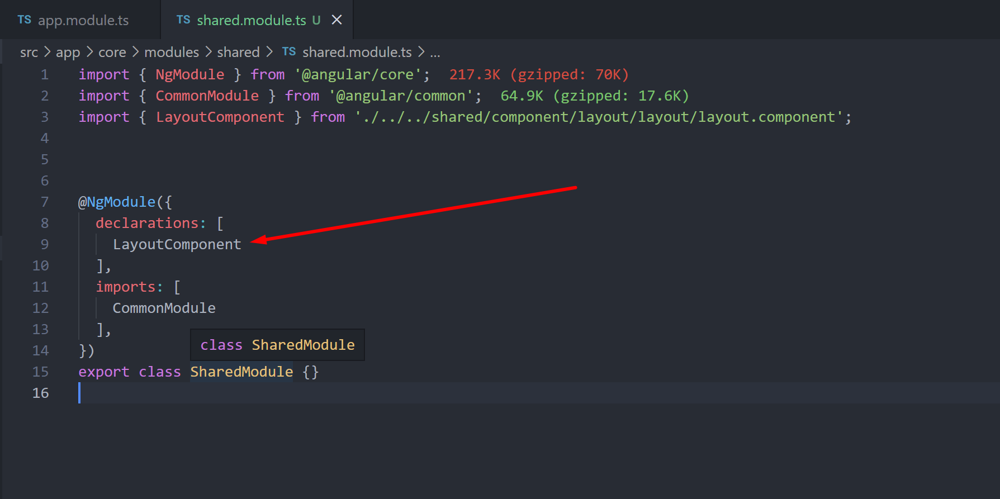

De esta manera podemos reutilizar el componente mas adeltante
 
 

Ahora trasladaremos nustros pipes, y directivas creadas el prework anterior de `AppModule` a `SharedModule`. Para ello escribimos lo siguiente despues del ultimo import en Shared module.

`import { DateCustomPipe } from './../../pipes/date-custom/date-custom.pipe';` y `import { ToLowerCaseDirective } from './../../directives/to-lower-case/to-lower-case.directive'`

Ahora usamos las nuevas clases y las agregamos en `declarations` quedando de la siguiente manera.

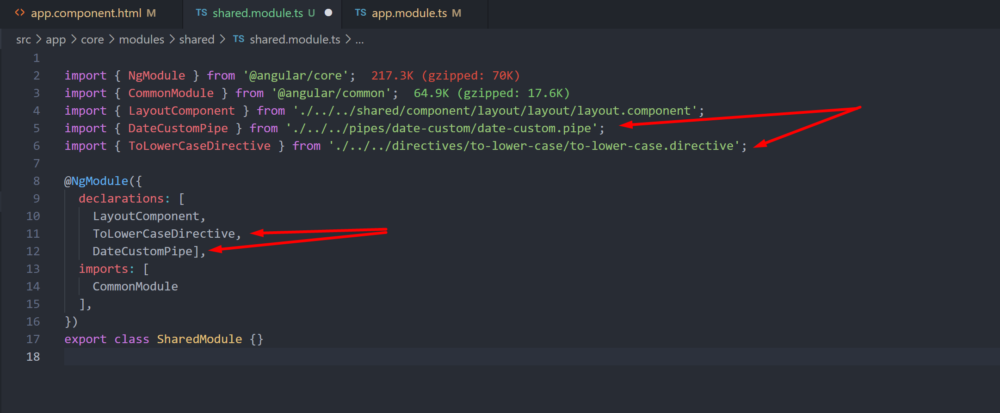

Ahora eliminamos las importaciones de AppModule y las clases para quedar de la siguiente forma.

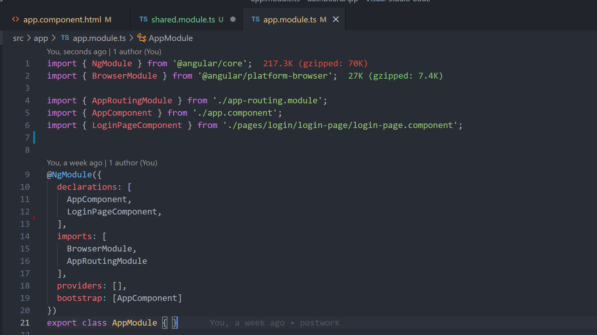
## Extras

Hasta este punto nuestro proyecto es funcional y tenemos todo listo para comenzar. Ahora vaciaremos nuestro AppComponent para que funcione como un Contenedor padre de toda la aplicacion.

Abre app.component.ts y elimina todo el contenido, despues escribe en el archivo el siguiente contenido `<router-outlet></router-outlet>` quedando de la siguiente manera: 

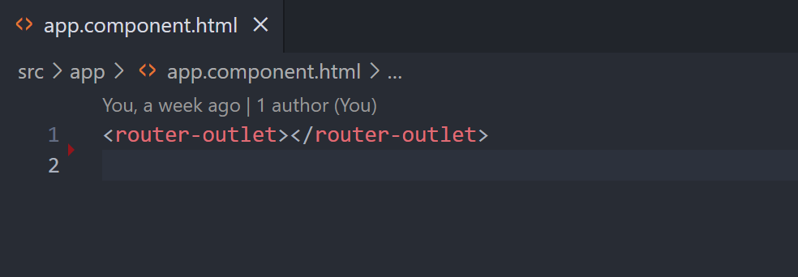

De esta manera podemos reutilizar el componente mas adeltante
 
 

En este punto tenemos la organizacion y distribucion de un buen proyecto angular.

