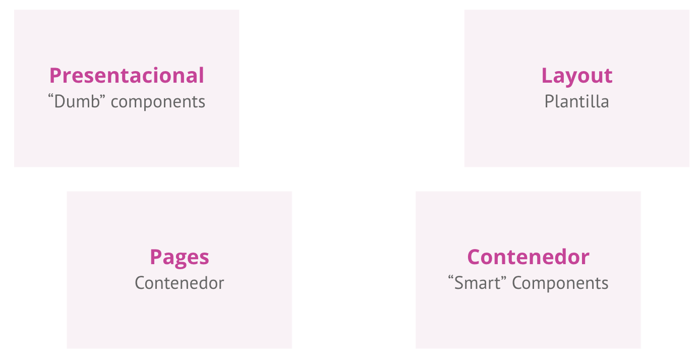
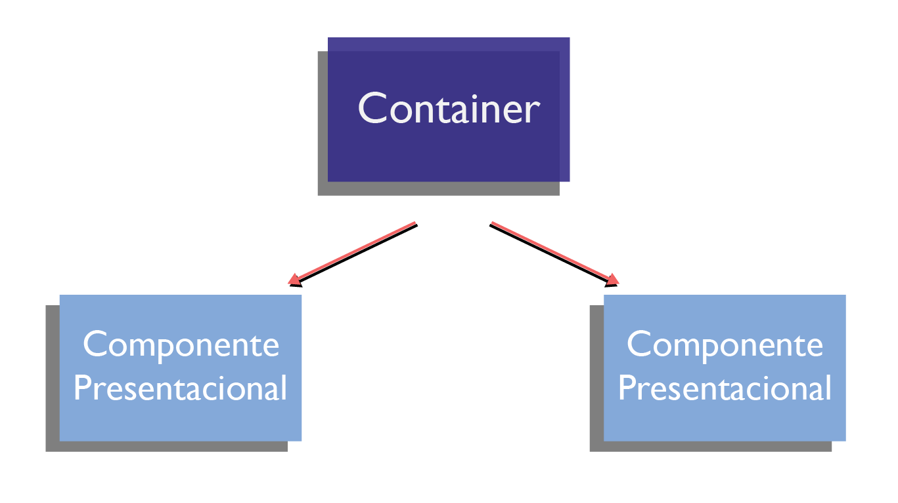
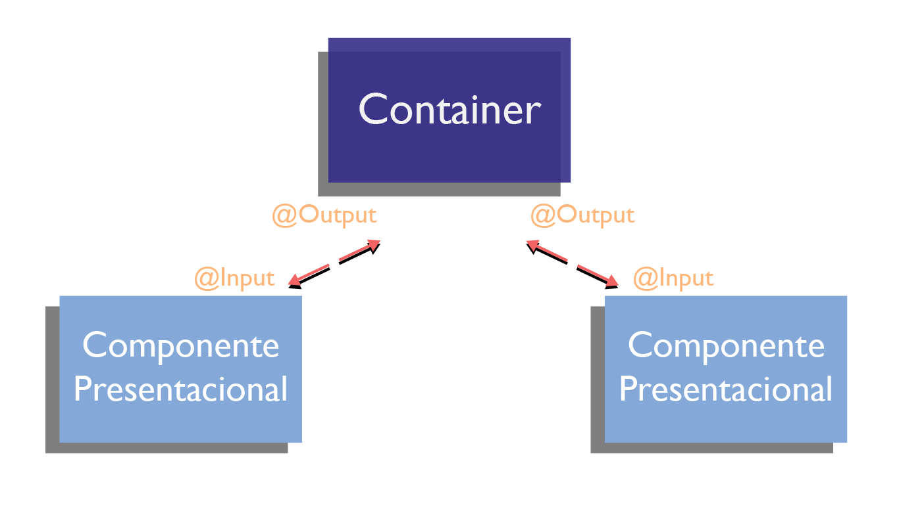
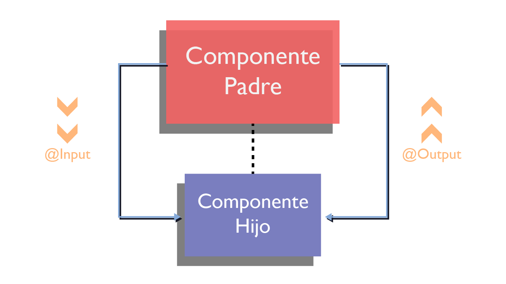
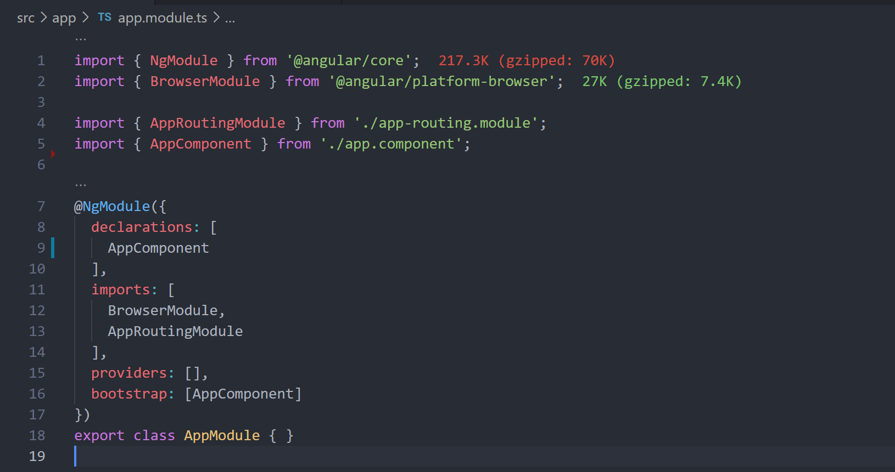
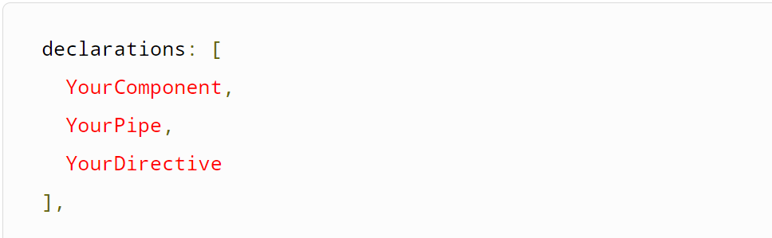
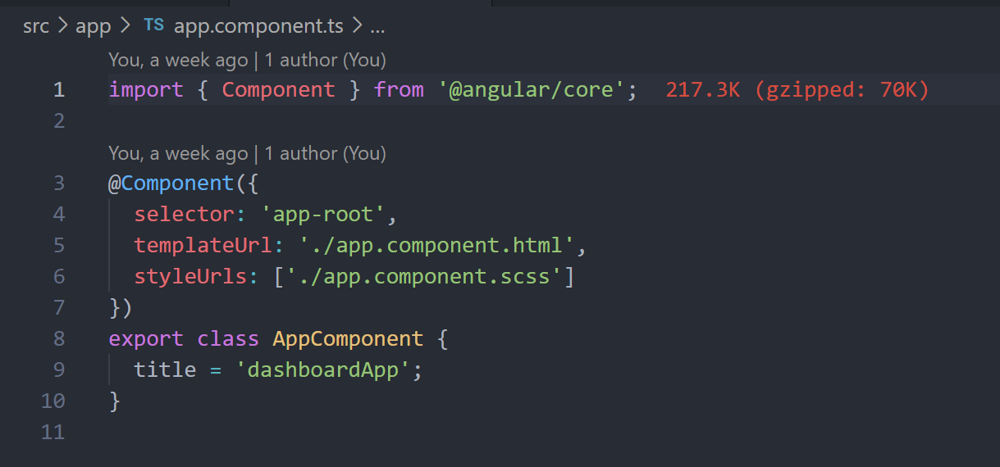

## Sesión 2: Fundamentos de Angular 🤖

### 1. Objetivos :dart: 

- Comprender La organizanacion de los componentes angular.
- Conocer el funcionamiento de ngModule
- Conocer el funcionamiento de AppComoponent

### 2. Contenido :blue_book:

Conocer una buena esttructura organizacional y comunicacion entre componentes es fundamental para crear aplicaciones escalables y mantenibles, es por ello que tocaremos las bases de una buena estructura para un proyectoi angualar.

---

 

#### <ins>Smart & Dump Components</ins>

Nuestras aplicaciones estan llenas de componentes y pensar en cómo queremos estructurarlos, nos ayuda en su arquitectura.
La mayoría de aplicaciones que construimos no son páginas estáticas, hay un estado y hay diferentes tipos de componentes donde el estado podría vivir.‌

Tipos de Componentes
 
 

__Presentational componentes o Componentes de presentación__
‌
Muy conocidos como Dumb o componentes tontos. Usan Inputs/Outputs para su comunicación.
Enviamos un valor al container, renderizamos los valores del container; emite un evento cuando está listo y algún otro componente administra el estado y hace las actualizaciones respectivas del estado.
‌
Con estos componentes nos probamos a nosotros mismos en cuanto a la separación de la complejidad en la lógica que podemos llegar hacer, en estos componentes no hay necesidad de crear servicios mockeados, o hacer alguna petición solo pasamos los inputs, se verifica alguna información de ser necesaria y se emite un output.
‌
__Container components o Componentes contenedores__
‌
Estos componentes son los Smart o inteligentes. Se encargan de conectar los “Dumb” al estado de la aplicación. Maneja los eventos emitidos, el de presentación emite un evento, y este responde a ese evento y se hace los llamados al servidor y actualiza lo necesario para ver los cambios necesarios en la UI o interfaz de usuario. El contenedor es el que controla otros componentes, es como un administrador, se encarga interactuar con los servicios o el state Management.
‌
__Layout components o componentes de diseño__
‌
Para estos no se maneja data, por lo que no es necesario una actualización cuando hay un cambio. Lo podemos ver como una página que tiene una estructura definida, o una plantilla que nos servirá para luego organizar otros componentes.

__P‌age components o componentes de página__

Los componentes de página funcionan como componentes contenedores, estos son los componentes que serán usados en el enrutamiento de nuestra aplicación.

__Flujo de Datos__
‌
Cuando estamos creando nuestra aplicación podemos usar los tipos de componentes de la siguiente forma:‌

 

Entre el contenedor y el componente de presentación, una forma de compartir la data es mediante Input y Output.

 

Un contenedor puede ser un componente padre, pero también un componente presentacional podría serlo, sin modificar el estado y solo compartiendo la información con sus hijos que viene desde un padre contenedor.

 

El Input nos permite pasar una data como entrada a nuestro componente, comúnmente la usamos para pasar data entre padres a hijos, si necesitáramos pasar desde el hijo al padre, usamos el Output.

 

- [**`EJEMPLO 1`**](./Ejemplo-01)

---

 

#### <ins>ngModule</ins>

Una vez que el proyecto está creado, la estructura o forma en la que se organiza es de suma importancia. No sólo nos ayuda a mantener nuestro código organizado, sino que también es importante para el funcionamiento de nuestra nueva app.

Los módulos son una muy buena forma de organizar una aplicación y extenderla con funcionalidades de bibliotecas externas.

Las bibliotecas de Angular son NgModules, como FormsModule, HttpClientModule, and RouterModule.

También hay disponibles bibliotecas de terceros, tales como Material Design, Ionic, o AngularFire2.

Los NgModules consolidan componentes, directivas y pipes en bloques cohesivos de funcionalidades, cada uno centrado en áreas distintas como funciones, aplicación de dominios business, flujo de trabajo, o recolección de utilidades.

Los módulos también pueden añadir servicios a la aplicación. Estos servicios pueden haber sido desarrollados internamente, es decir, puedes haberlos desarrollado tú mismo o venir de una fuente extena, como el cliente HTTP y router de Angular.

Los módulos se pueden cargar de forma entusiasta, cuando la aplicación se inicia; o de forma perezosa, cargados asíncronamente por el router.

Los metadatos NgModule hacen lo siguiente:

- Declarar qué componentes, directivas y pipes pertenecen al módulo.
- Hacer algunos de esos componentes, directivas y pipes públicos para que las templates de los componentes de otros módulos puedan utilizarlos.
Importar otros módulos con los componentes, directivas y pipes que los componentes del módulo actual requieren
- Proveer servicios que otros componentes de la aplicación pueden usar.
Todas las apps de Angular contienen como mínimo un módulo, el módulo root. Se hace bootstrap a ese módulo para iniciar la aplicación.

El módulo root es todo lo que necesitas en una aplicación simple de pocos componentes. Según tu app crezca, puedes refactorizar el módulo root en módulos de funcionalidades, que representan colecciones de funcionalidades similares. Luego, importa esos módulos al módulo root.

__El NgModule básico__
El CLI de Angular genera los siguientes AppModule básicos cuando crea una nueva app.

 

Un NgModule describe cómo encajan las partes de la aplicación. Cada aplicación tiene al menos un módulo Angular, el módulo root, que debe estar presente para arrancar la aplicación en el lanzamiento inicial. Por convención y por defecto, este NgModule se llama AppModule.

Después de las declaraciones de importación hay una clase con decorador @NgModule.

El decorador @NgModule identifica AppModule como una clase NgModule. @NgModule toma un objeto de metadatos que le dice a Angular cómo compilar e iniciar la aplicación.

 - declarations — el único componente de esta aplicación..
 - imports — importar BrowserModule para tener servicios específicos del navegador como renderizado DOM, sanitization y ubicación.
 - providers — los proveedores de servicios.
 - bootstrap — el componente raíz que Angular crea e inserta en la página web de host index.html.

La aplicación predeterminada creada por Angular CLI solo tiene un componente, AppComponent, por lo que está en los arrays de declarations y bootstrap.

__El array declarations__

El array de declarations le dice a Angular qué componentes pertenecen a ese módulo. A medida que crees más componentes, agrégalos a las declarations.

Debe declarar cada componente en exactamente una clase NgModule. Si se usa un componente sin declararlo, Angular devuelve un mensaje de error.

El array declarations solo acepta declarables. Declarables pueden ser componentes, directivas y pipes. Todos los declarables de un módulo deben estar en el array de declarations. Los declarables deben pertenecer exactamente a un módulo. El compilador emite un error si se intenta declarar la misma clase en más de un módulo.

Estas clases declaradas son visibles dentro del módulo pero invisibles a componentes en un módulo diferente, a menos que se exporten desde éste módulo y el otro módulo importe éste mismo módulo.

A continuación, se muestra un ejemplo de un array declarations:

 

Un declarable solo puede pertenecer a un módulo, por lo que solo debe ser declarado en un @NgModule. Cuando se necesite en otro lugar, importa el módulo que tiene el declarable que necesites.

Solo las referencias de @NgModule van en el array imports.

__El array de imports__

El array de imports del módulo aparece exclusivamente en el objeto de metadatos del @NgModule. Le dice a Angular sobre otros NgModules que este módulo en particular necesita para funcionar correctamente.

Esta lista de módulos son los que exportan componentes, directivas o pipes que las plantillas de componentes en este módulo hacen referencia. En este caso, el componente es AppComponent, que hace referencia a componentes, directivas o pipes en BrowserModule, FormsModule, o HttpClientModule. Una plantilla de componente puede hacer referencia a otro componente, directiva, o pipe cuando la clase referenciada se declara en este módulo o la clase se importó de otro módulo.

__El array providers__

El array providers es donde se enumeran los servicios que necesita la aplicación. Cuando enumera los servicios, están disponibles en toda la aplicación. Puedes reducir el scope al usar módulos de funciones y carga diferida. Para más información, ver Proveedores.

__El array bootstrap__

La aplicación se inicia haciendo bootstraping desde la raíz AppModule, que es también conocido como entryComponent. Entre otras cosas, el proceso de carga crea los componentes enumerados en el array de bootstrap e inserta cada uno en el DOM del navegador.

Cada componente bootstrap es la base de su propio árbol de componentes. La inserción de un componente bootstrapped generalmente desencadena una cascada de creaciones de componentes que completan ese árbol.

Si bien puedes colocar más de un árbol de componentes en una página web de host, la mayoría de las aplicaciones tienen solo un árbol de componentes y arrancan un solo componente raíz.

Este componente raíz se suele llamar AppComponent y se encuentra en el array bootstrap del módulo raíz.

- [**`RETO 1`**](./Reto-01)
---

 

#### <ins>AppComponent</ins>

Un componente es un elemento reutilizable, puede ser un elemento HTML como una lista, un botón, un header o un conjunto de etiquetas que cumplan con una funcionalidad.

__¿Como esta compuesto un componente en Angular?__

Un componente en Angular esta compuesto por:

 - Un archivo que sera nuestro Template/Vista (app.component.html).
 - Un archivo de lógica, el cual se encargara de la funcionalidad del componente, este archivo es un typescript del cual hablaremos mas adelante en la guía (app.component.ts).
 - Un archivo de estilos CSS para la maquetación de nuestro componente.

 Un componente puede tener mas archivos, depende del proyecto y de las necesidades del mismo. Entonces al final: la aplicación Angular es el todo y esta compuesta por varios componentes que la conforman.

__Estructura básica de un componente en Angular__
Si vemos el archivo AppComponent, veremos la estructura q
ue nos traen los archivos .css, .html y .ts. Los archivos .html y .css son los que menos misterio tienen ya que son archivos normales que inclusive podemos tener vacíos por el momento. Ambas sintaxis se escriben igual que siempre.

Algo importante de mencionar es que el css y html que escribamos aquí solo afectara a su componente no a los otros o al principal que se crea al iniciar el proyecto. Esto ayuda muchísimo ya que cada componente tiene sus estilos y evitamos el miedo de repetir clases o estilos que se encimen.

Si vemos ahora el archivo .ts también llamado controlador, es el que define la lógica del componente. La estructura básica es la siguiente:

 

Lo primero que realiza es importar Component de @angular/core, esto debido a que invoca el método @Component que tiene 3 propiedades:

- selector: El selector es el nombre que va a tener la etiqueta HTML que sirve para poder usar este componente, para este ejemplo del menu será `<app-menu></app-menu>`, es decir, desde el HTML de cualquier otro componente poniendo esa etiqueta se pintará el componente menu.
 - templateUrl: La ruta al archivo .html de ese componente para crear la vista.
 - styleUrls: La ruta al fichero .css de ese componente para los estilos de la vista.

Por último hacemos export class con el nombre del componente (sin guiones). Dentro del export se crea el método constructor (vacío por el momento).

**Nota al Experto:**
  
 + Recuerda que cada subtema puede contener un ejemplo, un reto, o más de un ejemplo y más de un reto. Recuerda borrar esta línea después de haberla leído.
- [**`RETO 2`**](./Reto-02)
---

 

### 3. Postwork :memo:

Encuentra las indicaciones y consejos para reflejar los avances de tu proyecto de este módulo.

- [**`POSTWORK SESIÓN 1`**](./Postwork/)

 

